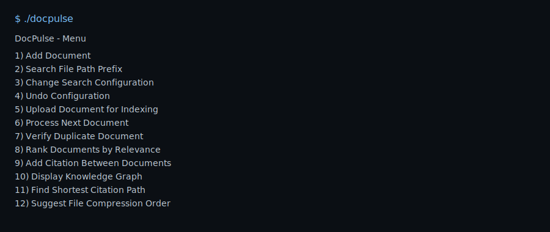

# DocPulse – Enterprise Document Search Token Engine

## Project Overview
DocPulse is a simulated internal search platform built as a Data Structures & Algorithms case study (B.Tech CSE Semester II). It demonstrates how classic data structures solve real-world search problems at scale: fast prefix lookups, undoable configuration changes, FIFO indexing, document integrity, relevance ranking, knowledge graph modeling, BFS-based traversal, and greedy-based space management.

## Problem Statement
Large organizations host millions of documents across departments. Users need immediate search responses while administrators need tools to manage indexing, configurations, and storage. DocPulse models these requirements with efficient data structures and explains the choices.

## Features
- Trie-based file path prefix search (fast auto-complete and prefix lookup)
- Stack-based configuration manager with undo (LIFO)
- Queue-based indexing pipeline (FIFO)
- Hash-based file integrity checks (duplicate detection)
- Priority-queue relevance sorter (max-heap)
- Knowledge graph for document citations (adjacency lists)
- BFS shortest-path traversal between documents
- Space manager (greedy max-heap) to suggest compression order

## Build

# DocPulse – Enterprise Document Search Token Engine

Version: 1.0

## 1. Project Title

DocPulse — an in-memory document search and management simulator demonstrating data-structure-driven building blocks used in search systems.

## 2. Problem Statement

Organizations hold large collections of documents. Users expect fast search results; administrators need indexing, duplicate detection, ranking, citation analysis, and storage management. DocPulse demonstrates how core data structures can be combined to meet these requirements in a simple, teachable system.

## 3. Objectives

- Demonstrate practical use of Trie, Stack, Queue, Heap, Hash-set, and Graph data structures.
- Provide a CLI to add documents, search by path prefix, queue/index documents, detect duplicates, rank results, manage citations, and suggest files to compress.
- Explain design choices and time/space complexity for educational use.

## 4. System Overview / Architecture

Modules (each in header+implementation files) and responsibilities:
- Document store (`Document.h` / implemented in `main.cpp`): holds document metadata (id, title, path, content, signature, relevance, size).
- Trie (`Trie.h/.cpp`): fast prefix-based lookup for file paths.
- ConfigManager (`ConfigManager.h/.cpp`): stack-based undoable configuration management.
- IndexQueue (`IndexQueue.h/.cpp`): FIFO queue for indexing pipeline.
- FileIntegrity (`FileIntegrity.h/.cpp`): signature generation and duplicate detection using a hash-set.
- RelevanceSorter (`RelevanceSorter.h/.cpp`): max-heap to return top relevant documents.
- KnowledgeGraph (`KnowledgeGraph.h/.cpp`): adjacency-list graph of citations with BFS shortest-path.
- SpaceManager (`SpaceManager.h/.cpp`): greedy max-heap suggesting compression order.

The `main.cpp` wires these modules together and provides a menu-driven CLI for user interaction.

## 5. Data Structures and Algorithms Used

- Trie: O(L) insert/search where L is string length; collects matching document ids via traversal from the prefix node.
- Stack: O(1) push/pop for undoable configuration.
- Queue: O(1) enqueue/dequeue for indexing pipeline.
- Hash-set + std::hash<string>: average O(1) duplicate checks (educational – not cryptographic).
- Priority queue (heap): O(log n) insert/pop for ranking and space suggestions.
- Graph (adjacency lists) + BFS: O(V + E) shortest-path queries.

## 6. Implementation Approach

Key implementation notes:
- Simple in-memory Document objects store metadata and content. The `generateSignature()` helper uses `std::hash<string>` over title|path|content.
- Trie implementation indexes ASCII characters (fixed 128 children) for simplicity.
- All modules are small, single-responsibility classes with clear APIs used by `main.cpp`.

Files to inspect for details: `Document.h`, `main.cpp`, `Trie.h/.cpp`, `ConfigManager.h/.cpp`, `IndexQueue.h/.cpp`, `FileIntegrity.h/.cpp`, `RelevanceSorter.h/.cpp`, `KnowledgeGraph.h/.cpp`, `SpaceManager.h/.cpp`.

## 7. Time and Space Complexity Analysis

(n = number of documents, L = length of a key/prefix, V/E = graph nodes/edges)
- Trie insert/search: Time O(L), Space O(sum of characters stored in nodes).
- Stack: O(1) time per operation, O(k) space for k saved states.
- Queue: O(1) time per operation, O(m) space for m queued items.
- Signature generation & lookup: average O(1) time, O(n) space for stored signatures.
- Priority queue operations: O(log n) for insert/pop.
- Graph (BFS): O(V + E) time, O(V) extra space for visited/parent bookkeeping.

Limitations: the Trie children array increases memory usage; `std::hash` is not collision-resistant.

## 8. Execution Steps

Prerequisites: g++ with C++17 support.

Build and run from the `DocPulse` folder:

```bash
g++ *.cpp -std=c++17 -o docpulse
./docpulse
```

If you see missing symbol errors, ensure all `.cpp` files are compiled together (the project is modular). On macOS with `zsh`, run the commands above from the project root.

## 9. Sample Inputs and Outputs

Example: Add two documents and search by prefix

1) Add Document (menu choice 1)
- Title: Design Spec A
- Path: /eng/specA.txt
- Content: Initial technical spec for module A.
- Relevance: 85
- File size: 120

2) Add Document (menu choice 1)
- Title: Engineering Notes
- Path: /eng/notes.txt
- Content: Meeting notes.
- Relevance: 70
- File size: 30

3) Search by prefix (menu choice 2)
- Prefix: /eng
Expected matches printed for ID 1 and ID 2 including titles and relevance.

Ranking example (menu choice 8) prints documents in descending relevance.

Indexing example (menu choices 5 then 6) will push a document to the index queue and process it, storing its signature in FileIntegrity. Verifying duplicates (menu choice 7) checks signature presence.

Paths and exact printed prompts depend on `main.cpp` menu text. Use the menu to explore other features (citations, BFS, compression suggestions).

## 10. Screenshots

Add example screenshots to a `screenshots/` directory and reference them here. Example markdown to include after adding files:

```markdown


```

If you want, tell me which screens you'd like and I can generate terminal screenshots and add them.

Rendered examples in this repo (created automatically):

```markdown



```

## 11. Results and Observations

- Tries give prefix-search time proportional to prefix length, making them ideal for auto-complete.
- Stack-based config undo and queue-based indexing clearly demonstrate LIFO/FIFO semantics.
- Priority queues efficiently return top-k items for ranking and space management.
- Signature-based duplicate detection is simple and fast for demos but should use cryptographic hashing in production.

## 12. Conclusion

DocPulse is an educational project that ties several core data structures into a cohesive demo of document search and management primitives. It is intended for learning, demonstration, and as a basis for further extension (persistence, stronger hashes, compressed tries, tests).

---

If you'd like, I can now:
- Add a `Makefile` to simplify compilation.
- Create unit tests for one or two modules (e.g., Trie + RelevanceSorter).
- Add example screenshots to `screenshots/` and commit them.

Tell me which follow-up you want and I'll add it.


The actual text printed depends on the exact `main.cpp` menu wording but the above illustrates expected behavior.

# SEM2-DSA1-
